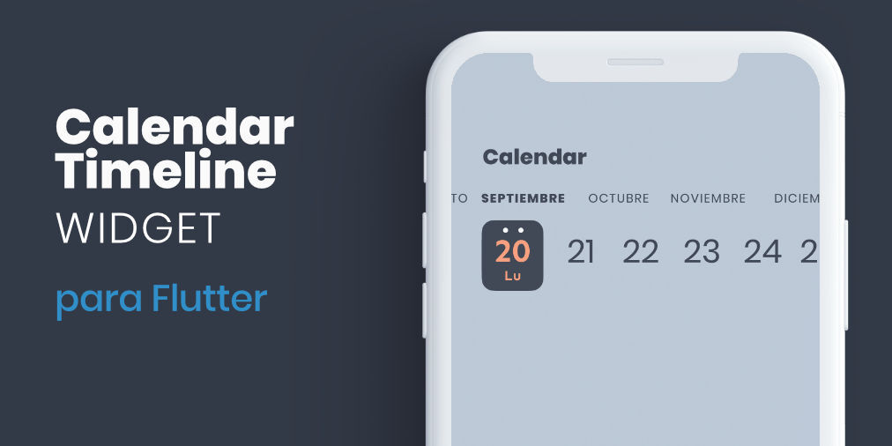
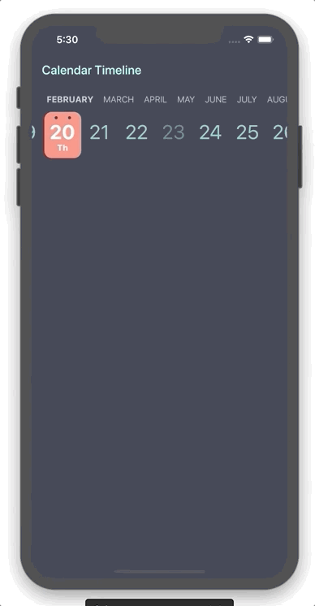

**Flutter widget form select a date in horizontal timeline with customizable styles.**

## Getting Started

You can use this package when you need to add a date picker that takes up little screen space, so we can always have it visible, and that facilitates use with one hand.



## Properties

| Property                 | Type                   | Description                                                 |
|:-------------------------|:-----------------------|:------------------------------------------------------------|
| initialDate              | DateTime               | Initial date selected                                       |
| firstDate                | DateTime               | First date available in calendar                            |
| lastDate                 | DateTime               | Last date available in calendar                             |
| selectableDayPredicate   | SelectableDayPredicate | Signature for predicating dates for enabled date selections |
| onDateSelected           | OnDateSelected         | Callback to notify that a date has been selected            |
| leftMargin               | double                 | Left margin to month and day list                           |
| monthColor               | Color                  | Color for month list elements                               |
| dayColor                 | Color                  | Color for day list elements                                 |
| activeDayColor           | Color                  | Color for selected day text                                 |
| activeBackgroundDayColor | Color                  | Color for selected day background                           |
| dotColor                 | Color                  | Color for top dots in select day                            |
| locale                   | String                 | Locale string to get formatted date                         |
| showYears                | bool                   | Indicates if it show year selector                           |


## Use example

You can review the example folder for a complete example of using the widget.

```
CalendarTimeline(
  initialDate: DateTime(2020, 4, 20),
  firstDate: DateTime(2019, 1, 15),
  lastDate: DateTime(2020, 11, 20),
  onDateSelected: (date) => print(date),
  leftMargin: 20,
  monthColor: Colors.blueGrey,
  dayColor: Colors.teal[200],
  activeDayColor: Colors.white,
  activeBackgroundDayColor: Colors.redAccent[100],
  dotsColor: Color(0xFF333A47),
  selectableDayPredicate: (date) => date.day != 23,
  locale: 'en_ISO',
)
```